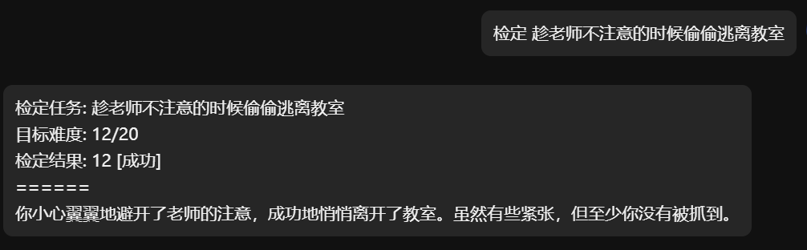

<div align="center">
  <a href="https://v2.nonebot.dev/store"></a>
  <br>
  <p></p>
</div>

<div align="center">
    ✨ 一只可爱的 AI 掷骰姬! ✨<br/>
    💬 技术交流/答疑/讨论 -> ：<a href="https://jq.qq.com/?_wv=1027&k=71t9iCT7">加入插件交流群-636925153</a> 🗨️ <br/>
    <a href="https://pypi.org/project/nonebot-plugin-dice-narrator">
        
    </a>
    
    <a href="https://jq.qq.com/?_wv=1027&k=71t9iCT7">
        
    </a>
</div>

# Dice Narrator

## 已实现功能列表

- 基础检定: [Command: 检定]

如果你有好的想法，欢迎提出 issue 或者 PR。

## 安装

```bash
nb plugin install nonebot-plugin-dice-narrator
```

## 使用

向 Bot 发送 `检定 任务描述` (需要指令前缀)，Bot 会根据其描述指定一个检定难度，并给出结果。

例如:



> 注意: 你可以检定任意内容的文本，但不是所有文本都能得到良好的反馈，建议内容文本为一段可执行的任务，同时可以附上一些简要的任务背景概况；避免使用疑问句、无意义短句等意义不明的语句。

## 开发指南

如果你想为 Dice Narrator 贡献代码，可以参考以下步骤：

### 0. 提交 issue

如果你希望你的代码被合并到主分支发布，请先提交 issue 说明你的想法，避免重复劳动或功能冲突。

### 1. 克隆代码

> 建议先 fork 项目到自己的仓库，然后再克隆自己仓库的代码。

```bash
git clone https://github.com/KroMiose/nonebot_plugin_dice_narrator.git
```

### 2. 安装开发环境依赖

```bash
poetry install
```

### 3. 运行项目

```bash
nb run --reload
```

## 🤝 贡献列表

感谢以下开发者对本项目做出的贡献

<a href="https://github.com/KroMiose/nonebot_plugin_dice_narrator/graphs/contributors">
  
</a>